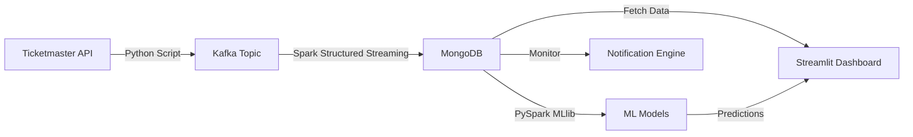

# 🎟️ Event Horizon (EventPulse)

**Event Horizon** is a real-time big data analytics platform that ingests live event data from Ticketmaster, processes it using Apache Spark and Kafka, performs Machine Learning predictions (Demand & Popularity), and visualizes insights via an interactive Streamlit dashboard.

---

## 🚀 Features

- **Real-time Ingestion**: Streams event data continuously from Ticketmaster API to Kafka.
- **Big Data Processing**: Spark Structured Streaming consumes Kafka data and writes to MongoDB.
- **Machine Learning**:
  - **Recommendation Engine**: Content-based filtering (TF-IDF + LSH) to suggest similar events.
  - **Demand Forecasting**: Regression model (GBTRegressor) to predict event sell-out risk (1-100).
  - **Popularity Classification**: Classification model to identify high-priority/viral events.
- **Interactive Dashboard**: A Streamlit UI for users to browse events, view predictions, and manage favorites.
- **Notification Engine**: Background service that alerts users about upcoming favorite events or new segment matches.

---

## 🏗️ Architecture



---

## 📋 Prerequisites

Before running the Python scripts, ensure you have the following installed on your system:

- **Java (JDK 8 or 11)**: Required for Spark and Kafka.
- **Apache Spark (3.5.x)**:
  - Ensure `SPARK_HOME` and `HADOOP_HOME` environment variables are set.
  - **Crucial**: You need the MongoDB and Kafka JARs in your Spark jars folder.
- **Apache Kafka**: Installed and running (Zookeeper + Broker).
- **MongoDB**: Installed and running locally on port 27017.
- **Python 3.9+**

---

## ⚙️ Setup & Installation

### 1. Clone the Repository

```bash
git clone <your-repo-url>
cd event-horizon
```

### 2. Install Python Dependencies

```bash
pip install -r requirements.txt
```

### 3. Configure JARs

The code references specific paths for Spark JARs (e.g., `C:/spark/...`).

- Open the `spark_consumer.py` and ML training scripts.
- Update the `KAFKA_JARS` and `jar_filenames` paths to point to your actual local Spark JAR directory.

**Required JARs:**
- mongo-spark-connector (versions 10.4.1 and 3.0.2 used in different scripts)
- spark-sql-kafka-0-10
- kafka-clients
- commons-pool2
- spark-token-provider-kafka

### 4. User Configuration

Create a `config.yaml` file in the root directory for user login credentials:

```yaml
credentials:
  usernames:
    admin:
      name: "Admin User"
      password: "password123"
    guest:
      name: "Guest User"
      password: "guestpass"
```

---

## 🏃‍♂️ How to Run

You must run these components in the following order:

### Step 1: Start Infrastructure

Start your Zookeeper, Kafka Server, and MongoDB Service.

```bash
# Example (Windows)
.\bin\windows\zookeeper-server-start.bat .\config\zookeeper.properties
.\bin\windows\kafka-server-start.bat .\config\server.properties
```

### Step 2: Start the Producer (Data Ingestion)

This pulls data from Ticketmaster and pushes to Kafka.

```bash
python kafka_producer.py
```

### Step 3: Start the Consumer (Spark Streaming)

This reads from Kafka and saves to MongoDB.

```bash
python spark_consumer.py
```

Wait for a few minutes for data to accumulate in MongoDB.

### Step 4: Train ML Models

The dashboard relies on trained models. Run these once data is available in MongoDB (min 50 records).

```bash
python train_recommender.py
python train_demand_model.py
python train_popularity_model.py
```

### Step 5: Start Notification Engine (Optional)

Runs in the background to check for alerts.

```bash
python notification_engine.py
```

### Step 6: Launch the Dashboard

```bash
streamlit run app.py
```

---

## 📂 Project Structure

- `kafka_producer.py`: Fetches data from API → Kafka.
- `spark_consumer.py`: Kafka → Spark → MongoDB.
- `train_*.py`: Scripts to train the ML models using PySpark.
- `app.py`: Main Streamlit entry point (Login page).
- `pages/dashboard.py`: Main analytics interface.
- `pages/profile.py`: User settings and favorites.
- `notification_engine.py`: Background logic for alerts.

---

## ⚠️ Troubleshooting

### JAR Errors

- If Spark fails with `ClassNotFoundException`, double-check the paths in the `spark.jars` config within the Python scripts.
- Ensure versions match (Scala 2.12 vs 2.13).

### Dashboard Empty

- Ensure `kafka_producer.py` is actually finding events (check API key limits).
- Ensure `spark_consumer.py` is successfully writing to MongoDB.

### Model Loading Errors

- Ensure you ran the `train_*.py` scripts successfully.
- Check that the `models/` directory was created.

---